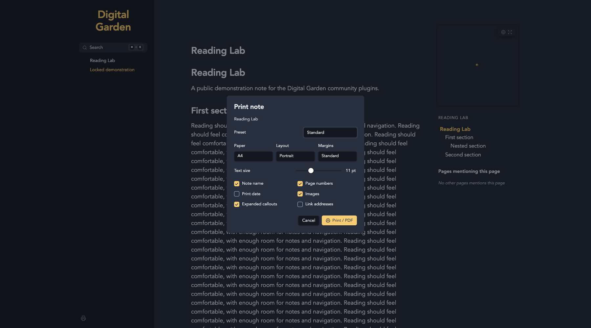

# Clean Print

Theme-independent printing with study-sheet presets, page numbering and complete folded sections.

## Installation

In Obsidian: Settings > Digital Garden > Plugins > Manage plugins > Browse & install. Until listed in the community gallery, use Install from GitHub with `koltensaccount/garden-plugin-clean-print`. A garden with current plugin support is required. Installation is file copying only; no setup scripts or dependencies need to run on the garden. Save settings and let the site rebuild.

## Usage

The printer button or Ctrl+P/Cmd+P opens Standard, Compact Study Sheet, Large Text and custom print options. The native browser dialog chooses printer/PDF destination. Printed notes use black text on white paper. CSS page numbers require current Chromium (131+); other browsers may omit them. Disable native headers/footers to avoid duplicates. Details, lazy-loading and added URL attributes are restored after printing. Heading Folding exposes complete content through print-only CSS, preserving screen folds.

## Settings

Compact Study Sheet uses 9 pt text and 12 mm margins (Standard: 11 pt / 18 mm; Large Text: 14 pt / 24 mm). Compact means more content fits on each page, not a narrower text column. Printed horizontal rules stay within the note's printable area; theme-only heading/rule pseudo-element decorations are omitted. Screen styling is unchanged. Keep the native print dialog's scale at 100% and avoid overriding the selected paper size or margins.

| Key | Setting | Default |
| --- | --- | --- |
| `includeTitle` | Include note name by default | true |
| `pageNumbers` | Include page numbers by default | true |
| `rememberOptions` | Remember visitor print options | true |
| `defaultPreset` | Default print preset | "Standard" |

## Compatibility and Accessibility

Works alone and with the other reading plugins. Shared footer controls use the neutral `dg-nav-tools` convention, with a floating fallback when navigation is absent. Each plugin ships the helper it needs; none imports another plugin. Current Digital Garden uses full-document navigation. Initialization is idempotent. Native controls, accessible labels, focus outlines and appropriate ARIA states are retained. Print styles remain separate from screen preferences. Browser storage failures fall back safely.

## Development

Node 22+; `npm ci`, `npm run check`, `npm test`. Tests use Node's test runner and Playwright's driver with an installed Chrome/Edge browser (`CHROME_PATH` overrides discovery). CI uses Ubuntu's Chrome. Browser tests never invoke an OS print dialog. The plugin files are ready to copy directly into `src/plugins/clean-print/` in a current test garden. Real upstream integration and combination checks are reported in `VALIDATION.md`.

## License

MIT, copyright 2026 Kolten Bendickson.
